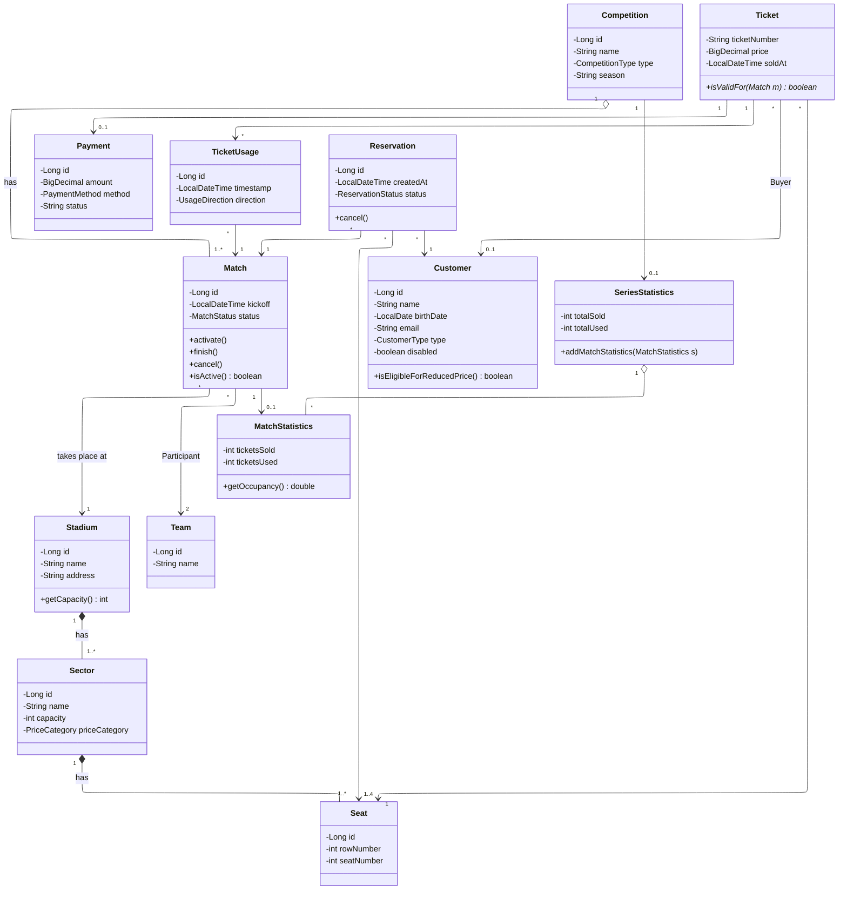

```mermaid
---
config:
  layout: elk
---
classDiagram
direction TB

class Stadium {
    -Long id
    -String name
    -String address
    +getCapacity() int
}
class Sector {
    -Long id
    -String name
    -int capacity
    -PriceCategory priceCategory
}
class Seat {
    -Long id
    -int rowNumber
    -int seatNumber
}
class Competition {
    -Long id
    -String name
    -CompetitionType type
    -String season
}
class Match {
    -Long id
    -LocalDateTime kickoff
    -MatchStatus status
    +activate()
    +finish()
    +cancel()
    +isActive() boolean
}
class Team {
    -Long id
    -String name
}
class Customer {
    -Long id
    -String name
    -LocalDate birthDate
    -String email
    -CustomerType type
    -boolean disabled
    +isEligibleForReducedPrice() boolean
}
class Ticket {
    -String ticketNumber
    -BigDecimal price
    -LocalDateTime soldAt
    +isValidFor(Match m)* boolean
}
class Payment {
    -Long id
    -BigDecimal amount
    -PaymentMethod method
    -String status
}
class TicketUsage {
    -Long id
    -LocalDateTime timestamp
    -UsageDirection direction
}
class Reservation {
    -Long id
    -LocalDateTime createdAt
    -ReservationStatus status
    +cancel()
}
class MatchStatistics {
    -int ticketsSold
    -int ticketsUsed
    +getOccupancy() double
}
class SeriesStatistics {
    -int totalSold
    -int totalUsed
    +addMatchStatistics(MatchStatistics s)
}

Stadium "1" *-- "1..*" Sector : has
Sector "1" *-- "1..*" Seat : has
Competition "1" o-- "1..*" Match : has
Match "*" --> "1" Stadium : takes place at
Match "*" --> "2" Team : Participant
Ticket "*" --> "1" Seat
Ticket "*" --> "0..1" Customer : Buyer
Ticket "1" --> "0..1" Payment
Ticket "1" --> "*" TicketUsage
TicketUsage "*" --> "1" Match
Reservation "*" --> "1" Customer
Reservation "*" --> "1" Match
Reservation "*" --> "1..4" Seat
Match "1" --> "0..1" MatchStatistics
Competition "1" --> "0..1" SeriesStatistics
SeriesStatistics "1" o-- "*" MatchStatistics
```
