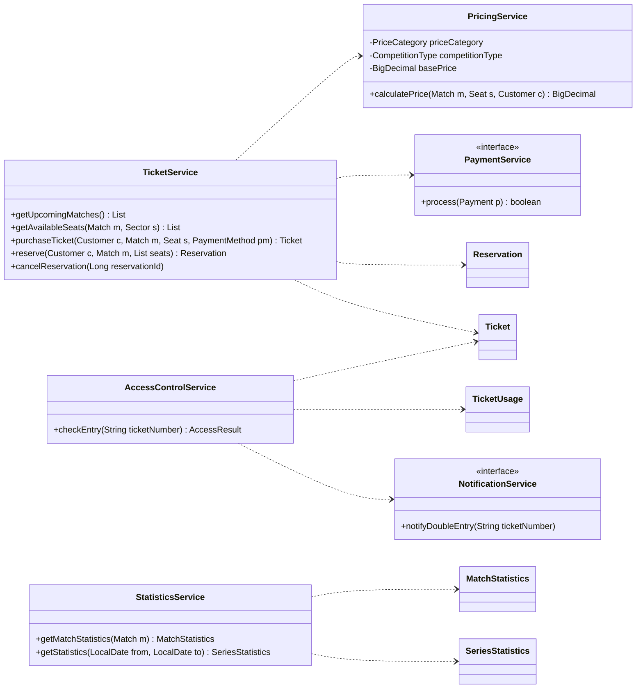

```mermaid

classDiagram
direction LR

class TicketService {
    +getUpcomingMatches() List
    +getAvailableSeats(Match m, Sector s) List
    +purchaseTicket(Customer c, Match m, Seat s, PaymentMethod pm) Ticket
    +reserve(Customer c, Match m, List seats) Reservation
    +cancelReservation(Long reservationId)
}
class PricingService {
    +calculatePrice(Match m, Seat s, Customer c) BigDecimal
    -PriceCategory priceCategory
    -CompetitionType competitionType
    -BigDecimal basePrice
}
class PaymentService {
    <<interface>>
    +process(Payment p) boolean
}
class AccessControlService {
    +checkEntry(String ticketNumber) AccessResult
}
class NotificationService {
    <<interface>>
    +notifyDoubleEntry(String ticketNumber)
}
class StatisticsService {
    +getMatchStatistics(Match m) MatchStatistics
    +getStatistics(LocalDate from, LocalDate to) SeriesStatistics
}
class Ticket
class Reservation
class TicketUsage
class MatchStatistics
class SeriesStatistics

TicketService ..> PricingService
TicketService ..> PaymentService
TicketService ..> Reservation
TicketService ..> Ticket
AccessControlService ..> Ticket
AccessControlService ..> TicketUsage
AccessControlService ..> NotificationService
StatisticsService ..> MatchStatistics
StatisticsService ..> SeriesStatistics

```
